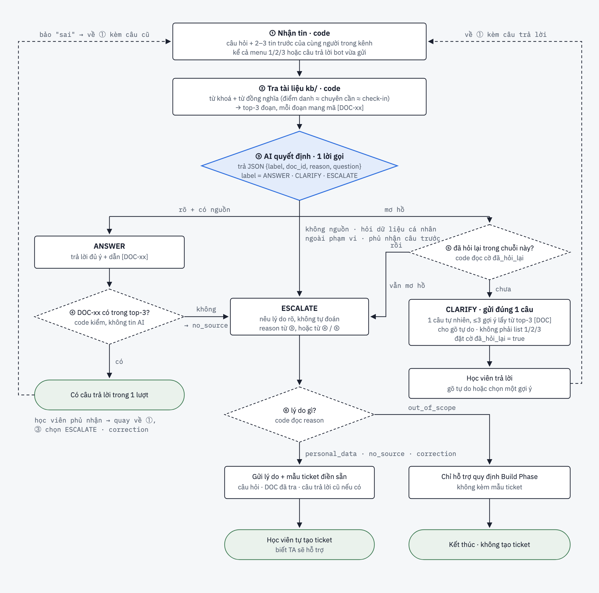

# AI SPEC — AskOnce · Nhóm TripleH · Zone 5
Hướng: [ ] A — VLearn  [x] B — Trợ lý Học viên  [ ] C — Làn mở
Loại: [x] Tối ưu tính năng có sẵn  [ ] Tính năng mới

> Chốt trước 21:00 17/9 (CP4). Quality bar ở §7 giữ nguyên sau thời điểm nộp.
> Canvas 4 ô: `canvas-cp1.md` · Golden set + kết quả: `eval/` · Nhật ký dùng thử: `validation/`

## §1. User & Job
- Job executor + workflow (đính kèm worksheet JTBD / ảnh sơ đồ):
- Core JTBD (không tên sản phẩm/AI trong câu):
- Problem statement (KHÔNG chữ AI):
- Evidence (chuẩn A và/hoặc B — log đầy đủ trong repo):
  - Số liệu mining / kết quả khảo sát (n = ?, % xác nhận):
  - ≥5 quote/ví dụ nguyên văn + nguồn:

## §2. Impact & quyết định chọn
- Bảng impact ≥3 ứng viên (bao nhiêu người · tần suất · tốn gì mỗi lần · khả thi):
- Ứng viên ĐÃ LOẠI + vì sao:
- Ứng viên CHỌN + vì sao (bằng số):

## §3. Giải pháp tương tự đã nghiên cứu
- [Sản phẩm 1]: flow / đáng học / đáng né / mình khác gì
- [Sản phẩm 2]: ...

## §4. Thiết kế
- Lát cắt MỘT CÂU (1 user · 1 việc · 1 quyết định AI · 1 kết quả): Một học viên K4 · hỏi bot một câu về quy định Build Phase · AI quyết định **trả lời ngay** (câu đã rõ và có căn cứ trong `kb/`), **hỏi lại đúng một câu** (thật sự thiếu thông tin), hoặc **chuyển TA** (không có căn cứ hoặc hỏi dữ liệu cá nhân) · học viên nhận câu trả lời có dẫn nguồn (DOC-xx) trong một lượt, không phải chọn menu 1/2/3.
- Sơ đồ luồng (①–⑥, chỉ ③ là AI; bản gốc + bảng so sánh hai luồng cũ ở `docs/flow-v2.html`):

  
- Non-goals (≥3 thứ KHÔNG build):
  1. Không hỗ trợ tạo/nộp ticket thay học viên — chỉ đưa mẫu điền sẵn (`docs/mau-ticket-escalate.md`), học viên tự xác nhận và gửi.
  2. Không hỏi lại quá 1 lần trong CLARIFY — lần 2 vẫn không rõ thì ép thành ESCALATE (chốt bằng code, không để LLM tự quyết định lặp).
  3. Không trả lời (ANSWER) khi `doc_id` không nằm trong top-3 tài liệu tra được — kể cả khi AI "tự tin" muốn trả lời, code vẫn ép chuyển ESCALATE (`reason: no_source`).
  4. Không trả dữ liệu cá nhân (điểm, điểm danh, XP của riêng một học viên) — luôn chuyển ticket TA (`reason: personal_data`), không tra `kb/` cho loại câu hỏi này.
- Mức prototype nhắm tới: [ ] Sketch [x] Mock [ ] Working — Mock: flow bấm được trọn (nhận câu hỏi → tra `kb/` → hiện kết quả), **AI thật ở lõi** (bước ③ gọi LLM 1 lần, trả JSON `label/doc_id/reason/question/answer` — `doc_id` là **một** mã DOC-xx, phải nằm trong top-3 bước ②); phần mock, ghi rõ trong `codebase/README.md`: (a) kênh Discord mô phỏng bằng web — tag bot, lịch sử 2–3 tin, mẫu `/ticket create`; cắm Discord API là việc để dành sau, không thuộc lát cắt; (b) `kb/` 9 DOC do nhóm tự soạn theo chủ đề hay hỏi trong `discord-pack`, không phải văn bản chính thức; (c) ticket là mẫu điền sẵn, học viên tự gửi. Khi không có key, engine chạy adapter local chỉ để test UI — không dùng làm số đo.
- Automation: [ ] augment [x] conditional [ ] automate — lý do theo cost-of-error: trả lời sai về XP/điểm danh/deadline khiến học viên mất điểm hoặc lỡ việc (đắt, khó sửa) → không cho AI tự trả lời khi thiếu căn cứ; nhưng hỏi lại thừa cho câu đã rõ cũng có giá — đang chiếm 20% câu trả lời của bot cũ, khiến học viên mất 3-10 phút mỗi lần (bằng chứng B, `canvas-cp1.md` §02) → nên để AI tự trả lời khi có nguồn, chỉ hỏi lại/chuyển người khi thật sự cần.
- §4b. Nguyên tắc đã áp dụng (≥4 — HAX/PAIR, xem guide):
  | Nguyên tắc | Áp cụ thể vào đâu trong prototype |
  |---|---|
  | **G2** — làm rõ nó làm tốt đến đâu | Mọi câu ANSWER hiện kèm "trả lời dựa trên [DOC-xx]"; nếu không có DOC-xx phù hợp thì không trả lời liều mà nói rõ chuyển TA — học viên biết khi nào nên tin. |
  | **G10** — thu hẹp phạm vi khi nghi ngờ *(bắt buộc)* | Bước ③④⑤: `doc_id` ngoài top-3 → ép `ESCALATE (no_source)`; nghi ngờ do thiếu ngữ cảnh → `CLARIFY` tối đa 1 câu, không "làm liều" đoán câu trả lời. |
  | **G11** — giải thích vì sao | Nhánh ANSWER và mẫu ticket (`docs/mau-ticket-escalate.md`) đều hiện dòng lý do cụ thể ("dựa trên DOC-xx" / "chưa tìm thấy tài liệu nói đúng câu này"), không chỉ báo kết quả suông. |
  | **G9** — sửa dễ dàng | Nhánh Correction: học viên phản hồi câu trả lời sai → quay lại bước ① với câu hỏi cũ, hoặc chọn thẳng ESCALATE — không phải mở lại từ đầu. |

## §5. Kiểu lỗi — 4 lớp chỗ khó + kịch bản (≥8) [bảng theo guide §2.5]

32 kịch bản, mỗi kịch bản là một case trong `eval/golden-set.json` (8 case/lớp), bảng đầy đủ ở `eval/risk-cases.md`. Dưới đây mỗi lớp 3 kịch bản tiêu biểu, cột cuối là kết quả thật ở lượt `run-model-1` (gpt-4.1-mini).

| Lớp chỗ khó | Rủi ro | Kịch bản (`msg_id`) | Kết quả đúng | run-model-1 |
|---|---|---|---|---|
| **1. Hỏi lại thừa khi câu đã rõ** — chính pain của bot cũ | Model thấy câu ngắn rồi mặc định CLARIFY, tái tạo menu 1/2/3 | "Khi nào bắt đầu tính XP?" (M49945) | ANSWER · DOC-01 | ✅ |
| | | "Ai phải nộp daily standup?" (M77407) | ANSWER · DOC-03 | ✅ |
| | | "Tạo ticket thế nào?" (M37242) | ANSWER · DOC-04 | ✅ |
| **2. Hiểu sai thuật ngữ / truy xuất sai DOC** | Tiếng Anh, viết tắt, lỗi chính tả kéo nhầm tài liệu | "pick topic trên Phoenix" (M98619) | ANSWER · DOC-06 | ✅ |
| | | "Xem rank cá nhân" (M20366) | ANSWER · DOC-09 | ✅ |
| | | "Các hình thức điểm danh" (M58070) | ANSWER · DOC-02 | ✅ |
| **3. Thiếu nguồn, dữ liệu cá nhân, ngoài phạm vi** | Model suy diễn từ DOC "gần nghĩa" hoặc trả lời chuyện riêng của một người | "Hoạt động của mình chưa được cộng XP" (M00499) | ESCALATE · personal_data | ✅ |
| | | "Ai cấp thiết bị cho đề tài phần cứng?" (M32673) | ESCALATE · out_of_scope | ❌ đúng nhãn, trả no_source |
| | | "Không đăng nhập được Phoenix" (M61735) | CLARIFY (hỏi lỗi gì) | ❌ trả personal_data |
| **4. Ngữ cảnh hội thoại và vòng hỏi lại** | Bỏ qua 2–3 tin trước, hoặc CLARIFY vô hạn | "Muộn sau 23h59" chưa nói việc gì (M20574) | CLARIFY | ✅ |
| | | "Cả ba" sau menu bot cũ (M95485) | ANSWER · DOC-03 | ✅ |
| | | "Điểm cộng trên lớp xem ở đâu?" (M83132) | CLARIFY (điểm gì?) | ❌ trả ANSWER DOC-09 |

Cách chặn theo lớp: (1) prompt ép "câu rõ + có nguồn → ANSWER ngay"; (2) retrieval dùng `kb/synonyms.json`, chỉ đưa top-3 vào model; (3) `verify.js` ép ANSWER phải có `doc_id ∈ top-3`, reason phải thuộc 4 giá trị; (4) truyền history cũ → mới, `askedOnce=true` mà còn CLARIFY thì code ép ESCALATE/no_source. Lớp 3 và 4 là nơi 4/4 case sai tập trung — xem §7.
## §6. Bốn đường đi của trải nghiệm
- **Happy path:** câu hỏi rõ, ② tra `kb/` ra ≥1 DOC-xx đúng chủ đề → ③ AI trả `ANSWER`, `doc_id` nằm trong top-3 → hiện câu trả lời kèm dẫn nguồn trong một lượt, không cần chọn menu.
- **Low-confidence (②) — thiếu ngữ cảnh:** câu hỏi thiếu thông tin thật (vd "muộn sau 23h59" không nói muộn việc gì) → ③ trả `CLARIFY` + 1 câu hỏi lại gợi từ top-3 DOC → học viên trả lời → quay lại ① với ngữ cảnh mới. Đã hỏi lại 1 lần (`askedOnce=true`) mà vẫn `CLARIFY` → code ép thành `ESCALATE`, không hỏi lại lần 2.
- **Failure/không căn cứ (①):** ② không tra ra DOC-xx nào khớp, hoặc ③ trả `doc_id` không nằm trong top-3 → ④ code kiểm và ép `ESCALATE (reason: no_source)` — không để AI tự bịa câu trả lời khi thiếu căn cứ.
- **Correction (user sửa):** học viên phản hồi câu ANSWER là sai/chưa đúng ý → quay lại bước ① kèm câu hỏi cũ + phản hồi, hoặc học viên chọn thẳng ESCALATE nếu muốn hỏi TA luôn — không bắt gõ lại câu hỏi từ đầu (G9).
- **Khi bị đòi ngoài phạm vi (③):** câu hỏi là quyết định của BTC/mentor (vd "chủ đề phần cứng tự chuẩn bị hay BTC cấp") mà `kb/` không có căn cứ chính thức → `ESCALATE (reason: out_of_scope)`, mẫu ticket ghi rõ lý do (`docs/mau-ticket-escalate.md`).
- **Case đặc thù domain (④):** câu hỏi đụng dữ liệu cá nhân của học viên (điểm, điểm danh, sự cố tài khoản riêng — vd "sao mình không thấy thuộc nhóm G nào") → luôn `ESCALATE (reason: personal_data)` ngay từ bước ③, không tra `kb/` cho loại này dù có vẻ liên quan đến chủ đề chung.

## §7. Kiểm thử
- Chiều chất lượng + định nghĩa kiểm chứng được:
  - **Nhãn đúng (Relevance):** pass nếu `label` (ANSWER/CLARIFY/ESCALATE) AI trả khớp `expected.label` trong golden set; fail nếu lệch.
  - **Có căn cứ, không bịa (Factuality):** với mọi case `ANSWER`, pass chỉ khi `doc_id` trả về nằm trong top-3 mà bước ② tra ra (kiểm bằng code, không chấm cảm tính) và trùng `expected.doc_id`; nếu AI trả `ANSWER` mà không có `doc_id` hợp lệ → tự động fail case đó dù nhãn đúng.
- Golden set (≥20 case theo cơ cấu trong guide §2.6, file trong `eval/`): dựng từ danh sách msg_id đã gán nhãn tay ở `docs/golden-set-msg-ids-cho-huong.md` (62 case: 52 ANSWER · 5 CLARIFY · 5 ESCALATE, gán theo phương pháp ở `docs/nhan-tay-63-menu.md`) — Hưởng chọn lọc đủ đa dạng chủ đề (khớp `kb/DOC-01..09`) và giữ toàn bộ 10 case CLARIFY/ESCALATE để không lệch hẳn về 1 lớp, bổ sung thêm case tự viết cho ≥8 kịch bản rủi ro ở CP4 (spec §5).
- Quality bar (chốt 21:00 17/9, giữ nguyên sau đó): **"Đạt khi ≥ 85% qua bộ 32 case, và không case nào ANSWER sai nguồn (Factuality fail = 0)."** Chọn 85% vì lượt CP3 đạt 87,5% với 4 case sai đều thuộc lớp 3–4 (ranh giới CLARIFY/ESCALATE), là vùng chấp nhận được với cost-of-error: sai theo hướng chuyển TA, không sai theo hướng bịa.
- Kết quả các lượt chạy (bảng % — cập nhật đến trước CP6). Chấm tự động bằng `eval/run.js`, trace từng case ở `eval/trace/`:

  | Lượt | Giờ 17/9 | Model | Case | Đúng | % | Factuality fail | 1 failure đáng kể nhất |
  |---|---|---|---|---|---|---|---|
  | `run-gemini-1` | 11:18 | gemini-3.6-flash (free) | 32 | 5 | 15,6 | 0 | 21/32 case dính HTTP 429/503 → ép no_source; không dùng làm số đo, là lý do thêm retry |
  | `run-openai-1` | 13:33 | gpt-4o-mini | 32 | 26 | 81,3 | 0 | 5/5 case CLARIFY sai — model chưa bao giờ chọn CLARIFY |
  | `run-model-1` | 13:54 | gpt-4.1-mini, prompt thêm định nghĩa + ví dụ CLARIFY | 32 | 28 | **87,5** | 0 | M61735 "không đăng nhập được Phoenix" → personal_data thay vì hỏi lỗi gì |

  Đối chiếu quality bar: `run-model-1` **đạt** (87,5 ≥ 85, Factuality fail = 0). Hai lượt `run-1`/`run-2` trong `eval/` chạy adapter local, không phải AI, không tính.

## §8. Phân công & kế hoạch
- Phân công có tên:
  | Việc | Người | Ở đâu trong repo |
  |---|---|---|
  | Spec, evidence (mining 63 menu, khảo sát), `kb/` 9 DOC, mẫu ticket, nộp 5 checkpoint | **Vũ Việt Hoàng** (đội trưởng) | `spec.md`, `docs/`, `kb/` |
  | Prompt ③, retrieval ②, verify ④⑤, golden set 32 case, các lượt eval | **Nguyễn Văn Hưởng** | `codebase/engine/`, `eval/` |
  | Giao diện demo ①⑤⑥, sơ đồ flow-v2, video CP3, validation với người dùng | **Lê Chí Hùng** | `codebase/index.html` `app.js` `style.css`, `docs/flow-v2.html`, `validation/` |
  | Demo CP6: mỗi người trình bày phần có tên mình | cả nhóm | |
- Willing users: **Nguyễn Vũ Anh**, **Nguyễn Duy Phong** (khai từ CP1). Kế hoạch validation: tối 17/9 – sáng 18/9, 5 người ngoài nhóm (2 willing user + 3 bạn cùng lớp), mỗi người 3 câu tự nghĩ + 1 câu "bảo sai" trên prototype web; ghi nhật ký ai thử · task · kẹt ở đâu · quote · quyết định vào `validation/`; sửa trước demo những gì lặp ≥2 lần.
- Multi-prototype: 2 phương án luồng đã so trước khi chốt (`docs/flow-v2.html`, bảng "Đổi gì so với hai luồng cũ"). Luồng 1: AI phân loại trước, không tra nguồn, hỏi lại được 2 lần. Luồng 2: tra `kb/` trước → AI trả JSON → code kiểm nguồn. Chọn luồng 2 + thêm nhánh correction từ luồng 1, vì cost-of-error: sai XP/điểm danh là mất điểm nên phải chặn bằng code trước khi tới học viên, và canvas chốt "tối đa 1 câu hỏi lại" không thể phụ thuộc LLM nhớ.

## §9. Changelog
| Thời điểm | Đổi gì | Vì sao (trỏ về feedback/case nào) |
|---|---|---|
| 16/9 20:30 | Chốt AskOnce, canvas 4 ô, luồng CP2 (mermaid) | Mining: 63/313 câu trả lời của bot cũ là menu thừa |
| 17/9 08:30 | Luồng v2: tra `kb/` trước AI, code kiểm DOC ∈ top-3, cờ đã_hỏi_lại trong code, tách 4 reason ESCALATE | Luồng 1 không kiểm nguồn; luồng 2 gộp "không nguồn/cá nhân" làm một; spec §6 cần correction |
| 17/9 10:40 | Chốt hợp đồng `decide({question, history, askedOnce})` giữa UI và engine; chia repo theo thư mục | Để 3 người làm song song không conflict git |
| 17/9 11:30 | `out_of_scope` cũng kèm mẫu ticket; thêm reason `correction` vào mẫu ticket; `doc_ids` → `doc_id` | Spec §6 (quyết định BTC/mentor cần TA) khác flow-v2 (chit-chat không ticket) — nhóm chốt theo spec |
| 17/9 13:30 | Prompt thêm định nghĩa CLARIFY cụ thể + ví dụ M20574, M61735 | `run-openai-1`: 5/5 case CLARIFY sai, model không bao giờ chọn nhãn này |
| 17/9 14:13 | Bỏ `policyGuardrail` (regex đè kết quả model), thêm retry 429/503 | Lượt 100% là regex viết theo golden set, vi phạm "không hardcode"; `run-gemini-1` rụng 21 case vì rate-limit |
| 17/9 15:30 | Khoá quality bar ≥ 85% + Factuality fail = 0 | `run-model-1` 87,5%; 4 case sai đều lệch về phía ESCALATE, không bịa |
